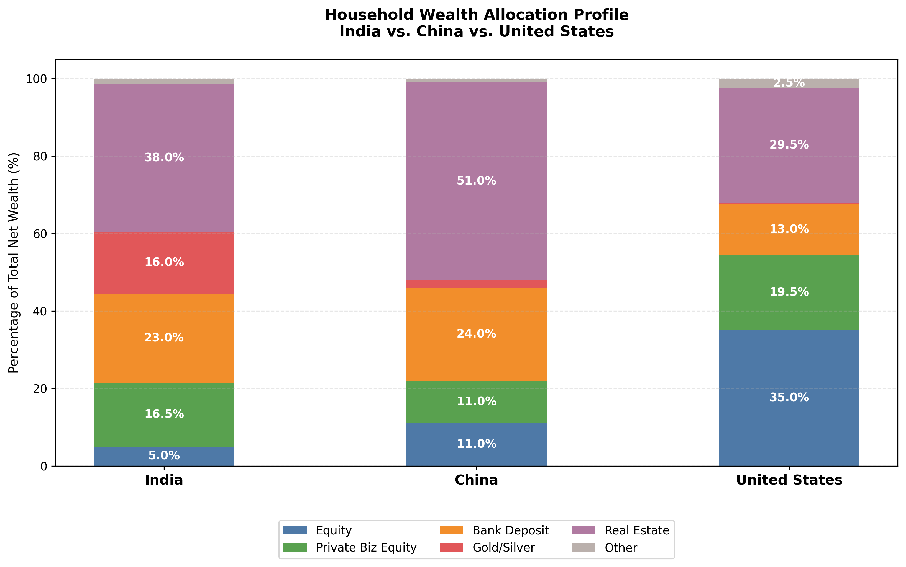

<div align="center">

# 📊 Comparative Household Wealth & Asset Class Allocation
### *India 🇮🇳 vs. China 🇨🇳 vs. United States 🇺🇸*

[](https://www.python.org/)
[](https://matplotlib.org/)
[](https://numpy.org/)
[](LICENSE)
[](https://github.com/)

<p align="center">
  <b>A comprehensive data visualization and macroeconomic comparative study analyzing how households across the world's leading economies distribute their net wealth across major asset classes.</b>
</p>

---

</div>

## 📌 Executive Summary

Household asset allocation patterns reveal profound insights into a nation’s economic structure, financial market maturity, historical inflation expectations, institutional trust, and cultural saving habits. 

This project provides an empirical, standardized comparative analysis of household balance sheets across **India**, **China**, and the **United States**, categorizing aggregate household net worth across six key asset classes:
1. **Public Equities** (Stocks, Mutual Funds, ETFs)
2. **Private Business Equity** (Unlisted shares, sole proprietorships, partnerships, family enterprises)
3. **Bank Deposits & Cash Equivalents** (Savings, fixed deposits, money market accounts)
4. **Gold & Precious Metals** (Physical bullion, jewelry as store of value)
5. **Real Estate** (Primary residences, residential land, rental properties)
6. **Other / Alternative Assets** (Vehicles, pensions/insurance reserves, collectibles)

---

## 📈 Visual Asset Class Distribution

<div align="center">
  
  <p><i>Figure 1: Standardized 100% Stacked Bar Chart illustrating Household Wealth Breakdown across India, China, and the USA.</i></p>
</div>

---

## 📊 Comprehensive Data Breakdown

The table below presents the normalized percentage distribution of aggregate household wealth across the three economies:

| Asset Class | India 🇮🇳 (%) | China 🇨🇳 (%) | United States 🇺🇸 (%) | Primary Drivers & Global Nuances |
| :--- | :---: | :---: | :---: | :--- |
| **📈 Public Equity** | `5.0%` | `11.0%` | `35.0%` | US 401(k)/IRA culture and liquid deep equity markets drive 7x higher equity penetration than India. |
| **🏢 Private Biz Equity** | `16.5%` | `11.0%` | `19.5%` | Widespread MSMEs/family businesses in India & vibrant entrepreneurial private capital in the US. |
| **🏦 Bank Deposits & Cash** | `23.0%` | `24.0%` | `13.0%` | High precautionary domestic savings rates and conservative risk profiles in Asian economies. |
| **🪙 Gold & Silver** | `16.0%` | `2.0%` | `0.5%` | Deep cultural heritage, inflation-hedging, and intergenerational transfer vehicle in India. |
| **🏠 Real Estate** | `38.0%` | `51.0%` | `29.5%` | Extreme real-estate reliance in China post-urbanization; solid core anchor in India and US. |
| **📦 Other / Alternatives** | `1.5%` | `1.0%` | `2.5%` | Consumer durables, vehicles, collectables, and diversified alternatives. |
| **Total** | **`100.0%`** | **`100.0%`** | **`100.0%`** | *Standardized aggregate household balance sheet.* |

---

## 🔍 Macroeconomic & Cultural Analysis

### 🇮🇳 1. India: Physical Asset Dominance & Tangible Security
* **Gold as an Institutional Parallel (`16.0%`):** India's affinity for precious metals is unparalleled globally. Gold serves dual roles as liquid collateral, inflation hedge, and intergenerational dowry/inheritance wealth.
* **Real Estate & Land (`38.0%`):** Real estate forms the bedrock of generational wealth, urban migration, and tax-advantaged capital deployment.
* **Nascent Financialization (`5.0%` Equity):** While mutual fund SIPs and retail demat accounts are experiencing exponential growth, public equity remains underrepresented relative to overall household net worth.
* **High Liquidity Cushion (`23.0%` Deposits):** High nominal fixed-deposit interest rates reinforce fixed-income reliance.

### 🇨🇳 2. China: Real Estate Heavyweight & High Precautionary Savings
* **Over-concentration in Property (`51.0%`):** Decades of rapid urbanization and limited alternative domestic investment channels made residential real estate the primary wealth-building vehicle.
* **Precautionary Cash Hoarding (`24.0%`):** China exhibits one of the world's highest household savings rates, driven by social safety net considerations, healthcare, and education provisioning.
* **Restrained Equity Exposure (`11.0%`):** Retail participation has historically been volatile, with wealth predominantly channeled into deposits and wealth management products (WMPs).

### 🇺🇸 3. United States: Capital Market Dominance & Financialization
* **Equity-Driven Wealth Engine (`35.0%` Public + `19.5%` Private = `54.5%` Total Equities):** Institutionalized retirement systems (401k, IRA, pension funds) and mature public capital markets channel over half of US household net worth directly into corporate equity.
* **Balanced Real Estate Portfolio (`29.5%`):** Homeownership remains a fundamental wealth pillar, but financial assets substantially outweigh physical property.
* **Minimal Precious Metals (`0.5%`):** Gold is largely viewed as a niche tactical hedge rather than a core household asset class.

---

## 🛠️ Project Structure & Reproduction

```text
India-China-USA-AssetClass-Distribution/
│
├── assets/
│   └── asset_distribution.png       # High-resolution rendered chart (300 DPI)
├── India_China_USA_AssetClass_Distribution.py  # Standalone reproducible visualization script
├── README.md                        # Project documentation and economic analysis
└── LICENSE                          # MIT License
```

### 🚀 Running Locally

1. **Clone the Repository:**
   ```bash
   git clone https://github.com/ishandutta2007/India-China-USA-AssetClass-Distribution.git
   cd India-China-USA-AssetClass-Distribution
   ```

2. **Install Dependencies:**
   ```bash
   pip install matplotlib numpy
   ```

3. **Execute the Visualization Script:**
   ```bash
   python India_China_USA_AssetClass_Distribution.py
   ```
   *The chart will be rendered, displayed, and automatically exported to `assets/asset_distribution.png`.*

---

## 📚 Data References & Sources

The aggregated distribution figures synthesize standardized household balance sheet benchmarks from leading macroeconomic statistical bureaus and wealth reports:
* **Reserve Bank of India (RBI)** – Household Financial Savings & All-India Debt and Investment Survey (AIDIS)
* **U.S. Federal Reserve** – Survey of Consumer Finances (SCF) & Financial Accounts of the United States (Z.1)
* **People's Bank of China (PBOC)** & Southwestern University of Finance and Economics – China Household Finance Survey (CHFS)
* **UBS / Credit Suisse** – Global Wealth Report

---

## 📄 License

This repository is licensed under the [MIT License](LICENSE). Feel free to use, modify, and cite this research and code for educational, research, or commercial applications.

---

<div align="center">
  <sub>Authored with ❤️ by <a href="https://github.com/ishandutta2007">Ishan Dutta</a></sub>
</div>
